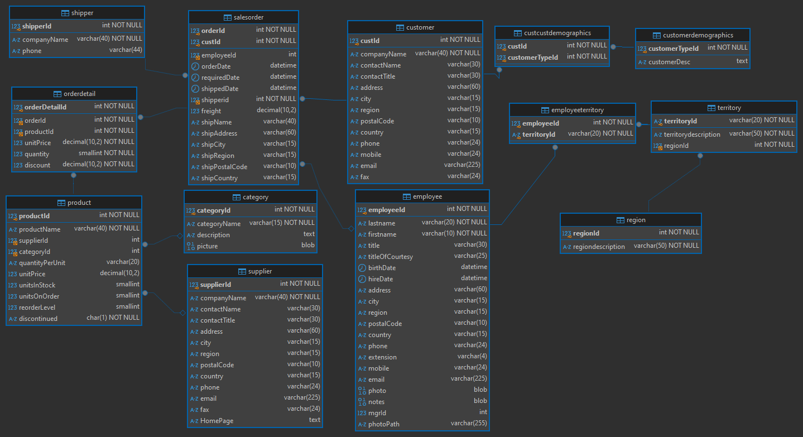
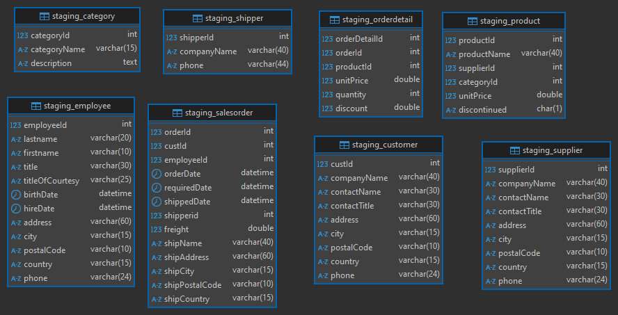
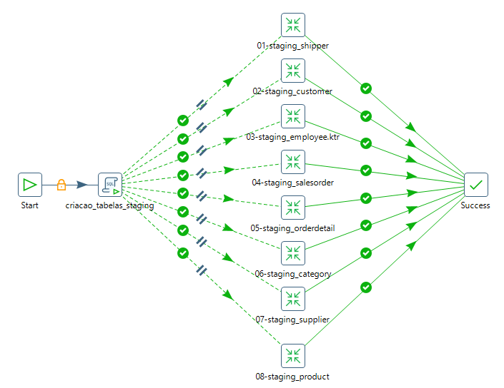
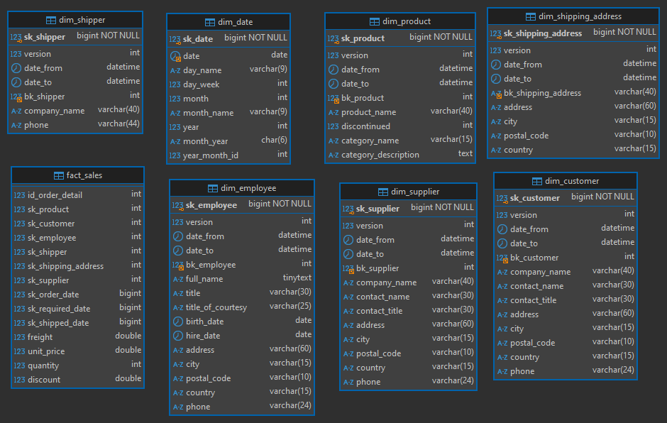
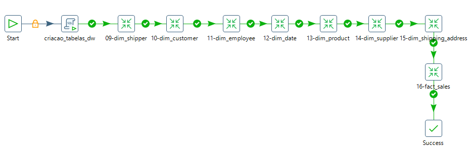
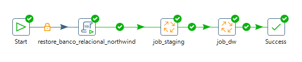

# ETL do Banco Relacional para Dimensional (DW) - Northwind 🏢📊

Este projeto exemplifica o processo de **ETL (Extract, Transform, Load)** para criação de um banco dimensional Data Warehouse (DW) a partir do banco relacional Northwind, utilizando a ferramenta **Pentaho Data Integration (PDI)**. O objetivo é demonstrar um caso de uso simples e flexível, destacando as etapas de carga para a **staging area** e posteriormente a criação do **DW**.

## 🚀 Visão Geral

O processo visa gerar indicadores de resultados de vendas e está estruturado para trabalhar com as seguintes entidades:

- **category**
- **customer**
- **employee**
- **orderdetail**
- **salesorder**
- **product**
- **shipper**
- **supplier**

### 🛠️ Etapas do Projeto

1. **Carga Inicial para Staging Area**: As tabelas relevantes do banco `northwind` são extraídas e carregadas no banco de staging, chamado `northwind_staging`. Este banco foi criado com foco na **performance de consulta e carga**, sem relacionamentos físicos entre as tabelas.

   
   
<em>Figura 1: Diagrama do banco relacional northwind.</em>

   
   
<em>Figura 2: Diagrama do banco northwind_staging.</em>

3. **Pipeline de Carga para Staging**: O pipeline (job) abaixo mostra o processo de consulta ao banco `northwind` e carga para o banco `northwind_staging`:

   
   
<em>Figura 3: Pipeline de carga do banco relacional northwind para staging area northwind_staging.</em>

4. **Transformação e Carga para o Data Warehouse**: Após a carga inicial, é realizada a transformação e carga para o ambiente dimensional `northwind_dw`. Esse ambiente foi modelado com foco em performance e flexibilidade futura para lidar com dimensões do tipo **SCD (Slowly Changing Dimension)**. No entanto, atualmente as dimensões são atualizadas diretamente (sem histórico). As dimensões e fatos criados são:

   - **Dimensões**:
     - `dim_customer`
     - `dim_date`
     - `dim_employee`
     - `dim_product`
     - `dim_shipper`
     - `dim_shipping_address`
     - `dim_supplier`
   
   - **Tabela Fato**:
     - `fact_sales`

   A integridade referencial é mantida pelo processo de ETL, garantindo performance. Optou-se por **não criar chaves estrangeiras (FK)** físicas entre fatos e dimensões, e a **tabela fato não possui chave primária (PK)**, o que maximiza a **eficiência de carga e consulta**. Ao evitar a verificação de chaves durante o processo de carga, o tempo de inserção é reduzido significativamente, o que é crucial em cenários com grandes volumes de dados.

   
   
<em>Figura 4: Diagrama do banco dimensional northwind_dw.</em>

6. **Pipeline de Carga para o Data Warehouse (DW)**: O pipeline (job) abaixo realiza a transformação e carga dos dados do ambiente `northwind_staging` para o `northwind_dw`:

   
   
<em>Figura 5: Pipeline de carga do banco staging area northwind_staging para o dw northwind_dw.</em>

### 🌍 Ambiente de Desenvolvimento

O exemplo foi desenvolvido e testado em um ambiente local, mas para ambientes de produção, é **recomendado separar os ambientes** (staging e DW) do ambiente de produção. Essa separação evita que o processo de transformação impacte negativamente o sistema de produção, isolando os recursos e garantindo a integridade e a performance da aplicação principal.

   
   
<em>Figura 6: Pipeline de orquestração principal.</em>

### 📂 Estrutura de Arquivos e Utilização

Todos os arquivos necessários para as transformações, pipelines (jobs) e o script SQL estão disponíveis no arquivo `data_jobs_transformations.rar`. Basta extrair o conteúdo para acessar os seguintes recursos:

- **Transformações e Pipelines (Jobs)**: Inclui todos os pipelines configurados para realizar as etapas de carga inicial para a staging area e o Data Warehouse, além do **job principal** (`job_principal.kjb`), que orquestra todo o processo de ETL.
- **Script SQL (`dump_database_relacional_northwind.sql`)**: Responsável pela criação do banco relacional `northwind` inicial.

> **Como utilizar**: 
> 1. Extraia o conteúdo de `data_jobs_transformations.rar`.
> 2. Abra o Pentaho Data Integration (PDI).
> 3. Importe as transformações e jobs para o Pentaho Data Integration (PDI).
> 4. Para configurar as variáveis de ambiente, pressione `Ctrl + Alt + J` enquanto estiver na área principal do Spoon. Na janela que será aberta, defina os seguintes parâmetros:
>    - `HOST_ORIGEM_MYSQL`: Host do banco de dados.
>    - `USER_ORIGEM_MYSQL`: Usuário do banco de dados.
>    - `PASS_ORIGEM_MYSQL`: Senha do banco de dados.
> 5. Execute o **job principal** (`job_principal.kjb`) para automatizar a criação do banco relacional `northwind` e as etapas de criação da staging area (`northwind_staging`) e do Data Warehouse (`northwind_dw`).

> **Nota**: O job utiliza o script (`dump_database_relacional_northwind.sql`) para criar o ambiente inicial `northwind`.

### 🧰 Ferramentas Utilizadas

- **Banco de Dados**: MySQL 8.0.30
- **ETL**: Pentaho Data Integration (PDI)
- **IDE para Consultas**: DBeaver

## 📝 Observações Finais

Este é um exemplo básico de um processo ETL utilizando o banco Northwind. Existem diversas outras abordagens e técnicas que poderiam ser aplicadas dependendo das necessidades específicas de negócio e das políticas de integração e segurança do ambiente.

## 📜 Licença

Este projeto é licenciado sob a licença **MIT**, permitindo que você use, copie e modifique o software de acordo com as necessidades do seu projeto. Veja o arquivo `LICENSE` para mais detalhes.

---

© 2024 - Projeto de ETL Northwind DW 🚀
